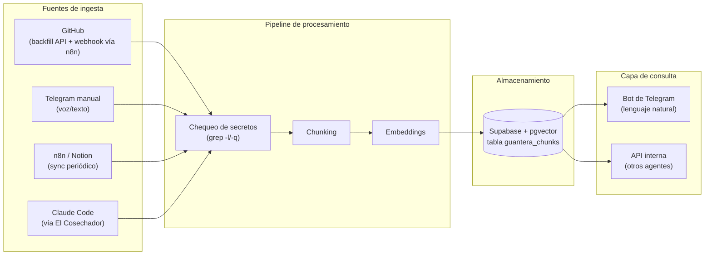

# La Guantera — Brief de Proyecto

**Reto Julio, Imperio Agéntico — proyecto de infraestructura**
**Estado:** brief cerrado, pendiente de modo plan
**Repo propuesto:** `JuanIA-sketch/la-guantera`

---

## 1. Contexto

La Guantera es uno de los proyectos del reto de Julio dentro de Imperio Agéntico, junto a herramientas ya publicadas como El Freno de Mano, El Paracaídas, El Instalador de un Clic, El Doctor, Batallas del Imperio Agéntico y La Alarma. A diferencia de esas (que son herramientas puntuales), La Guantera es un proyecto de infraestructura: una capa de memoria que se sienta debajo de todo lo demás que Charly ha construido este mes y en meses anteriores.

## 2. Objetivo

Construir una memoria estructurada y consultable de todo el ecosistema de Charly.marketing — repos de GitHub, workflows de n8n, páginas de Notion y contexto de sesiones de Claude Code — con búsqueda por **significado** (embeddings), no por palabra clave. Obsidian es una fuente opcional más, no el núcleo del sistema.

## 3. Para quién

- **Uso personal (núcleo del caso de uso):** Charly necesita encontrar decisiones técnicas, fragmentos de código o conversaciones pasadas sin recordar en qué repo, workflow o chat quedaron.
- **Comunidad (reutilización secundaria):** miembros de Imperio Agéntico con un stack similar (varios repos + n8n + chats de agentes) pueden adaptar la misma arquitectura. Quien apenas empieza con un solo bot no necesita esto todavía, pero el patrón (fuentes heterogéneas → embeddings → búsqueda semántica → API) es reutilizable, igual que el Radar Empleo lo fue con su arquitectura por perfil.

## 4. Diferencial

**vs. memoria de Claude:** La Guantera indexa fuentes que Claude no ve directamente (repos, n8n, el negocio completo), guarda el contenido exacto con su fuente citada (no un resumen con sesgo de recencia), y expone una API para que otros agentes del stack la consulten directamente.

**vs. Obsidian:** Obsidian es una bodega de notas con búsqueda por palabra clave/etiqueta, sin ingesta automática y sin API. La Guantera se conecta directamente a las fuentes que ya existen (sin transcribir nada a mano), busca por significado, y expone una API programática. Obsidian puede ser una fuente más que alimenta a La Guantera, no su reemplazo.

## 5. Arquitectura general



*Fase 1: GitHub + Telegram manual. Fase 2: n8n/Notion + Claude Code + API multi-agente.*

Todo el pipeline vive como un servicio interno más en el VPS de Hostinger (mismo patrón que los demás agentes: puerto propio, expuesto solo en `172.17.0.1`, orquestado desde n8n). No se construye infraestructura nueva de cero — se reutiliza lo ya aprobado.

## 6. Fuentes de ingesta

### 6.1 GitHub
Vía el nodo **GitHub Trigger** de n8n (no un webhook receiver a medida): n8n ya soporta eventos `push`, `pull_request`, `issues`, etc. de forma nativa, y como n8n ya es el orquestador aprobado en el VPS, esto evita construir infraestructura de recepción de webhooks nueva. Requiere permisos de owner/admin sobre el repo para registrar el webhook — Charly ya los tiene sobre `JuanIA-sketch/*`.

**Importante — el webhook por sí solo no basta.** El GitHub Trigger solo dispara con eventos *nuevos*, hacia adelante; no trae nada de lo que ya existe en el repo. Para que el bot pueda responder sobre decisiones ya tomadas (el dolor real que motiva este proyecto), Fase 1 necesita además una **carga inicial (backfill)** que recorra el historial existente de cada repo elegido vía la API de GitHub (REST o GraphQL) antes de activar el webhook — no es algo que se pueda resolver solo con n8n escuchando hacia adelante.

**Decisiones pendientes:**
- Qué repos entran en Fase 1: recomendado empezar con los activos de julio (la-alarma, el-arquitecto, etc.) y no con todo `JuanIA-sketch/*` de una vez.
- Cuánto historial se hace backfill: ¿todo el historial de commits del repo, o solo los últimos N meses? Todo el historial da más cobertura pero también más tokens de embeddings que pagar de una sola vez.

### 6.2 n8n / Notion (Fase 2)
Sync periódico: nodo Schedule Trigger en n8n consultando la API de n8n (para workflows/ejecuciones propias) y la API de Notion (para páginas/bases). No hay push nativo aquí, así que es polling programado, no webhook.

### 6.3 Claude Code (Fase 2)
No existe una API oficial para leer transcripciones de sesiones de Claude Code, y su formato no está estandarizado para este fin. En vez de parsear transcripts crudos, **la Guantera consume lo que El Cosechador ya captura** (sesiones, entregables, patrones de error, historial de eficiencia) — esto evita construir un parser frágil y reutiliza una pieza que ya existe y ya funciona.

### 6.4 Telegram manual
Notas sueltas por voz o texto directo al bot. Es la fuente más simple técnicamente y no depende de ninguna sincronización externa.

## 7. Pipeline de procesamiento

### 7.1 Chequeo de secretos (antes de todo)
Antes de que cualquier contenido entre al chunking, pasa por un chequeo tipo `grep -l`/`grep -q` (el mismo patrón ya establecido para escanear credenciales) para evitar vectorizar por accidente una clave o token que haya quedado en un commit o en una nota. Esto no es opcional: es no negociable, igual que con Claude Code.

### 7.2 Chunking
Estrategia distinta según el tipo de fuente:
- **Código (GitHub):** por archivo o por función, con overlap pequeño.
- **Texto libre (notas, Notion, conversaciones):** por párrafo o quiebre semántico, ~400–600 tokens con solapamiento de 50–100 tokens.

### 7.3 Embeddings — decisión verificada
**OpenCode Go (el endpoint que da acceso a GLM-5.2/DeepSeek, `https://opencode.ai/zen/go/v1`) expone únicamente un endpoint de chat/completions compatible con OpenAI — no un endpoint de embeddings.** Este es un patrón común: muchos proveedores que exponen chat/completions estilo OpenAI no incluyen el endpoint de embeddings, y no encontré evidencia de que GLM-5.2 lo tenga a través de OpenCode Go. Esto significa que **la Guantera necesita un proveedor de embeddings separado** — no se puede resolver dentro de la suscripción de $10/mes que ya tienes.

Recomendación: **OpenAI `text-embedding-3-small`** — $0.02 por cada millón de tokens (o $0.01 vía Batch API), 1536 dimensiones, es el estándar de facto para RAG en 2026 por su relación costo/calidad. Para el volumen de un proyecto personal esto es centavos al mes. Alternativa aún más barata si quieres exprimir el costo: Google `text-embedding-005` (~$0.006/millón), pero añade un proveedor más al stack en vez de reutilizar algo ya conocido.

**Importante — el consumo no es solo al cargar:** cada vez que Charly le pregunta algo al bot, esa pregunta también se convierte a embedding (mismo proveedor, misma llamada) para poder compararla contra lo ya guardado. Hay consumo en dos momentos: al ingerir contenido nuevo y al consultar. La diferencia es que una pregunta es mucho más corta que un commit o una nota completa, así que el costo por consulta es menor todavía que el de ingesta. Con uso diario normal (varias decenas de preguntas al día) el consumo mensual total — ingesta + consultas sumadas — sigue estando en fracciones de dólar.

**Decisión pendiente:** confirmar si vale la pena crear una cuenta de OpenAI solo para esto (nuevo proveedor en el stack) o preferir Google por ya tener algo relacionado — a decidir en modo plan.

**Control de costo adicional:** el pipeline debe evitar re-generar el embedding de contenido que no cambió (por ejemplo, en una re-sincronización de n8n/Notion que vuelve a traer páginas ya indexadas). Esto no es solo higiene de datos — es lo que evita pagar dos veces por lo mismo.

### 7.4 Almacenamiento vectorial
Se reutiliza el **mismo proyecto de Supabase** que ya usa charly-prospecting (no uno nuevo), con una tabla separada (`guantera_chunks`) para no mezclar datos de negocio con esta memoria. Índice **HNSW con `vector_cosine_ops`** — es la recomendación estándar actual de Supabase para pgvector y es la opción correcta para un volumen de datos personal (muy por debajo del millón de filas donde HNSW se vuelve costoso de construir). Ver `scripts/schema.sql`.

## 8. Capa de consulta

**Fase 1:** bot de Telegram — Charly le escribe (o le habla) una pregunta en lenguaje natural, el bot busca por similitud semántica en `guantera_chunks` y responde con el contenido exacto del chunk más relevante + la fuente citada (repo/commit, nota, etc.). Nunca un resumen: el contenido tal cual quedó guardado.

**Requisito firme, no negociable:** el bot solo responde (y solo acepta notas manuales) de chat_id autorizados, empezando por el de Charly. El contenido indexado incluye código y contexto de negocio, así que el bot nunca puede quedar abierto a cualquier usuario de Telegram — ni para consultar, ni para escribir notas nuevas.

**Fase 2:** API HTTP interna (mismo patrón de red que los demás agentes: solo accesible dentro del VPS) para que otros agentes del stack — el orquestador de charly-marketing, charly-prospecting, etc. — puedan consultar La Guantera como si fuera una base de conocimiento compartida del negocio.

## 9. Decisiones técnicas abiertas

Estas son las que se deben resolver en modo plan o confirmar con Charly antes de programar — no están adivinadas en este brief para no meter falsa certeza donde no la hay:

1. **Proveedor de embeddings:** OpenAI text-embedding-3-small (recomendado) vs. Google text-embedding-005 vs. otra alternativa. Define la dimensión del vector en el esquema (hoy puesto en 1536 como placeholder).
2. **Bot de Telegram:** ¿reutilizar el bot existente que ya envía las rutinas diarias (chat_id 742163352) agregando comandos nuevos, o crear un bot dedicado solo para La Guantera? Reutilizar simplifica tokens pero mezcla propósitos. Cualquiera de las dos opciones debe cumplir el requisito de control de acceso de la sección 8.
3. **Alcance inicial de repos en GitHub:** ¿cuáles exactamente entran en Fase 1? Recomendado: solo los activos de julio, no todo `JuanIA-sketch/*`.
4. **Profundidad del backfill histórico (sección 6.1):** ¿se carga todo el historial de commits de cada repo elegido, o solo los últimos N meses? Todo el historial da más cobertura pero más tokens de embeddings de una sola vez.
5. **Qué datos concretos expone El Cosechador** que se puedan indexar tal cual, sin transformación adicional (para la ingesta de Claude Code en Fase 2).
6. **Nivel de detalle del diff de GitHub:** ¿se indexa el mensaje de commit + archivos tocados, o el diff completo? El diff completo da más contexto pero más ruido y más tokens de embeddings.
7. **Contenido desactualizado o eliminado en la fuente original (Fase 2+):** si un commit se revierte, o se borra una página de Notion, el chunk ya embebido en `guantera_chunks` no se actualiza solo. No bloquea Fase 1, pero conviene decidir pronto si se maneja con una fecha de "última verificación" o con un proceso de limpieza periódico, para que La Guantera no termine citando como vigente algo que ya no lo es.

## 10. Fases de desarrollo

Dos fases, no más — la primera cargada lo suficiente para que no se termine en minutos si se deja corriendo sola.

### Fase 1 — MVP funcional de punta a punta
- **Backfill inicial** del historial existente de los repos elegidos (vía API de GitHub), no solo eventos futuros
- Ingesta de GitHub hacia adelante (vía n8n GitHub Trigger) para los repos activos de julio
- Ingesta de notas manuales por Telegram (texto y voz)
- Control de acceso del bot por chat_id autorizado (consulta e ingesta manual)
- Chequeo de secretos antes de indexar, para las 4 fuentes (grep -l/-q)
- Chunking diferenciado por tipo de fuente
- Generación de embeddings + escritura en `guantera_chunks` (Supabase/pgvector, índice HNSW), evitando re-embeber contenido sin cambios
- Bot de Telegram con búsqueda semántica en lenguaje natural, respondiendo con contenido exacto + fuente citada
- Suite de tests con Vitest cubriendo cada módulo (ingesta, chunking, embeddings, almacenamiento, consulta)
- **README real + script de setup** (ver sección 12) — sin esto, Fase 1 no está completa

**Criterio de "listo":** Charly le pregunta al bot algo sobre una decisión tomada *antes* de que La Guantera existiera (no solo sobre algo nuevo) y recibe la respuesta correcta con la fuente citada, sin buscar manualmente en GitHub o Telegram, y sin que el bot responda a nadie más que a él. Además, el sistema completo se puede instalar desde cero siguiendo solo el README, sin ayuda adicional.

### Fase 2 — Expansión de fuentes y acceso multi-agente
- Sync periódico de n8n (API de n8n) y Notion (API de Notion)
- Ingesta de contexto de Claude Code vía El Cosechador
- API HTTP interna para que otros agentes del stack consulten La Guantera
- Filtros de búsqueda por fuente y rango de fecha
- (Opcional si da tiempo) reranking simple de resultados

**Criterio de "listo":** al menos un agente externo hace una consulta HTTP y recibe resultados relevantes con fuente citada, y las 4 fuentes están sincronizándose sin intervención manual.

## 11. Estructura del repo

```
la-guantera/
├── README.md
├── docs/
│   └── BRIEF.md              (este documento)
├── package.json
├── tsconfig.json
├── .gitignore
├── .env.example
├── src/
│   ├── ingesta/
│   │   ├── github.ts
│   │   ├── telegram-manual.ts
│   │   └── notion-n8n.ts     (Fase 2)
│   ├── procesamiento/
│   │   ├── chunking.ts
│   │   └── embeddings.ts
│   ├── almacenamiento/
│   │   └── supabase-client.ts
│   ├── consulta/
│   │   ├── query-engine.ts
│   │   ├── telegram-bot.ts
│   │   └── api.ts            (Fase 2)
│   └── index.ts
├── tests/
│   └── (misma estructura que src/, TDD red→green con Vitest)
└── scripts/
    ├── schema.sql
    └── setup.ts                  (aplica schema.sql + valida variables de entorno)
```

## 12. Instalación y facilidad de uso

**Principio:** que alguien lo instale es el objetivo real, no un efecto secundario. La barrera de entrada de este proyecto es más alta que la de El Doctor o La Alarma (necesita VPS, n8n, Supabase, un proveedor de embeddings) — eso no se puede eliminar del todo, pero sí se puede evitar que la instalación sea *más* difícil de lo que el proyecto exige por naturaleza. Donde haya opción entre "más simple pero manual" y "más sofisticado pero con más pasos para quien instala", se prefiere lo primero.

Concretamente, Fase 1 no se da por "lista" solo con el código funcionando — incluye:
- **Un `README.md` real** (el actual es un placeholder) con los pasos completos y en orden: clonar el repo, instalar dependencias, llenar el `.env`, aplicar `schema.sql`, crear el bot en BotFather, conectar el webhook de GitHub en n8n, correr el backfill inicial.
- **Un script de setup** que automatice lo que se pueda en vez de dejarlo manual: aplicar `schema.sql` con un comando en vez de copiar/pegar en el editor SQL de Supabase, y validar que las variables de entorno necesarias estén presentes antes de arrancar (fallar rápido y con un mensaje claro, no a medio camino).
- **Validación real:** antes de darlo por terminado, instalar el sistema siguiendo únicamente el README, en una máquina o entorno limpio, sin usar memoria de cómo se construyó. Si algo requiere un paso no escrito, el README está incompleto.

Esto no significa construir ahora el wizard completo de El Instalador de un Clic para La Guantera — eso sigue siendo válido como mejora de Fase 2/3 si se quiere bajar la barrera todavía más — pero sí significa que la Fase 1, tal como queda entregada, ya se pueda instalar sin depender de que Charly recuerde algo que no esté escrito.

## 13. No negociables

Los mismos de siempre, aplicados a este proyecto:
- `git push` y `gh repo create` siempre requieren confirmación explícita de Charly.
- Nunca entran secretos reales a la sesión de Claude Code — solo fixtures sintéticos, incluso para probar la ingesta de GitHub.
- Escaneo de credenciales siempre con `grep -l` o `grep -q`, nunca `grep -n`.
- Chequeo de secretos en el pipeline de ingesta (sección 7.1) antes de vectorizar cualquier contenido — esto es específico de La Guantera, dado que indexa contenido de repos reales.
- El bot de Telegram (consulta e ingesta manual) solo responde a chat_id autorizados — nunca abierto a cualquier usuario (sección 8).

## 14. Estrategia de testing

TDD rojo→verde con Vitest, igual que el resto de los proyectos del reto: se escribe la prueba que falla, se implementa lo mínimo para que pase, se refactoriza. Cada módulo (ingesta, chunking, embeddings, almacenamiento, consulta) tiene su propia carpeta de tests en paralelo a `src/`.

## 15. Métricas de éxito

- Fase 1: al menos 3 preguntas reales de prueba (no inventadas) respondidas correctamente por el bot, con fuente citada verificable.
- Al menos una de esas 3 preguntas debe ser sobre contenido *anterior* al lanzamiento de La Guantera, para confirmar que el backfill realmente trajo el historial y no solo eventos nuevos.
- Tiempo de respuesta del bot: referencia razonable, sub-5 segundos por consulta.
- Cero secretos reales indexados (verificable revisando el contenido de `guantera_chunks` tras la ingesta inicial).
- El bot rechaza (o simplemente ignora) mensajes de cualquier chat_id no autorizado — probado explícitamente, no solo asumido.
- Charly instala el sistema de punta a punta en una máquina o entorno limpio siguiendo solo el README, sin necesitar ayuda adicional ni recordar pasos no escritos.

## 16. Nota para el post de Logros

Esta herramienta es más "plomería invisible" que "wow visual" — no hay una captura de pantalla que venda sola. El gancho de before/after más convincente es un número de tiempo real: cronometrar cuánto toma hoy encontrar una decisión tomada hace semanas buscando manualmente en 3-4 lugares, vs. cuánto tarda preguntándole al bot y recibiendo la fuente citada. Vale la pena hacer esa cronometrada real (no estimada) antes de escribir el post.
